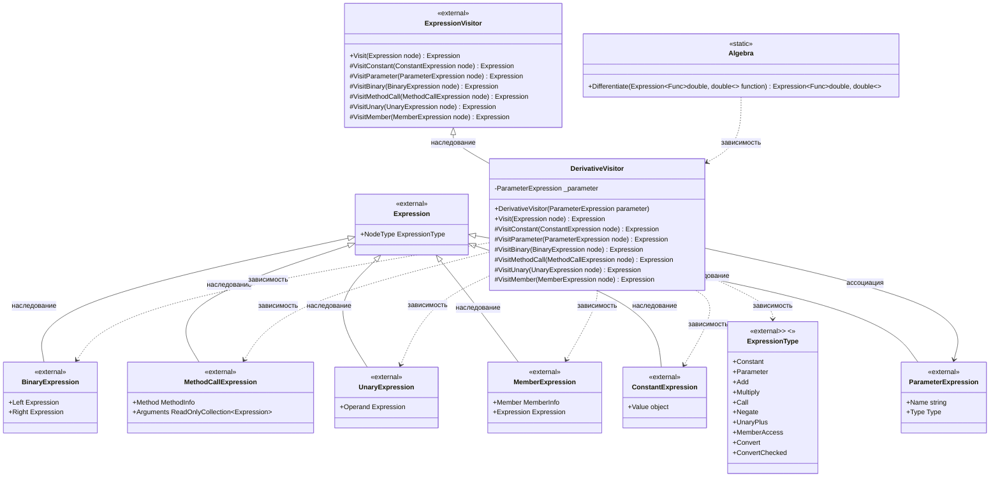

# Практика: Дифференцирование

## 1. Описание предметной области и сущностей

Выражения представлены в виде деревьев с помощью выражений LINQ(библиотека System.Linq.Expressions). Каждый узел дерева соответствует операции или значению.
Я выбрал паттерн «Посетитель» (наследование от ExpressionVisitor) для решения задачи, потому что это самый нормальный способ обхода деревьев выражений C#(.NET). Он позволяет чётко разделить логику дифференцирования по типам узлов, переопределяя соответствующие виртуальные методы, что даёт легко расширять код, добавляя новые операции и функции.

Сущности:

Algebra - статический класс, предоставляющий публичный метод Differentiate для символьного дифференцирования. Создаёт экземпляр DerivativeVisitor и делегирует ему обход дерева выражения.

DerivativeVisitor - класс-наследник ExpressionVisitor, реализующий логику дифференцирования. Содержит приватное поле _parameter - переменную, по которой ведётся дифференцирование. Для каждого типа узла переопределяет соответствующий метод посещения, применяя правила дифференцирования.

ExpressionVisitor - системный базовый класс из System.Linq.Expressions, реализующий обход деревьев выражений(это паттерн Посетитель). Предоставляет виртуальные методы для каждого типа узла.

Expression - абстрактный базовый класс всех узлов дерева выражений. Содержит свойство NodeType типа ExpressionType, которое определяет тип узла.

ConstantExpression - узел, представляющий числовую константу. При дифференцировании даёт 0.0.

ParameterExpression - узел, представляющий параметр функции. Производная равна 1.0, если это переменная дифференцирования.

BinaryExpression - узел бинарной операции. Имеет свойства Left и Right - левое и правое подвыражения. Поддерживаются операции Add (сумма) и Multiply (умножение).

MethodCallExpression - узел вызова метода. Содержит информацию о вызываемом методе (Method) и список аргументов (Arguments). Поддерживаются только статические методы Math.Sin и Math.Cos с одним аргументом.

UnaryExpression - узел унарной операции. Имеет свойство Operand - подвыражение, к которому применяется операция. Поддерживаются Negate (унарный минус), UnaryPlus (унарный плюс), Convert и ConvertChecked (преобразования типов).

MemberExpression - узел доступа к члену (свойству или полю). Не поддерживается, но обрабатывается для выдачи информативных исключений.

ExpressionType - перечисление, идентифицирующее тип узла. Используется для определения правила дифференцирования.
Я выбрал паттерн «Посетитель» (наследование от ExpressionVisitor) для решения задачи, потому что это стандартный и наиболее естественный способ обхода деревьев выражений в .NET — он позволяет чётко разделить логику дифференцирования по типам узлов, переопределяя соответствующие виртуальные методы, что делает код легко расширяемым для добавления новых операций и функций.

## 2. Диаграмма классов (Mermaid)

