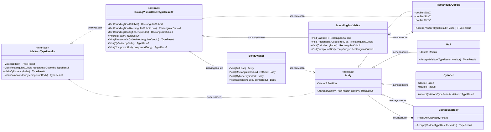

# Практика: Геометрия-2

## 1. Описание предметной области и сущностей
В данной работе был использован паттерн Visitor
- IVisitor<TypeResult> - интерфейс посетителя, реализация паттерна Visitor. Имеет метод Visit для каждого типа фигуры.
- Body - абстрактный класс базовая фигура. Содержит позицию (Position) и метод Accept, который принимает посетителя.
- Ball - класс шар с радиусом Radius.
- RectangularCuboid - класс прямоугольный параллелепипед с трёхмерными размерами SizeX, SizeY, SizeZ.
- Cylinder - класс цилиндр с высотой SizeZ и радиусом Radius.
- CompoundBody - класс "составное тело", содержит список частей (Parts).
- BoxingVisitorBase<TypeResult> - абстрактный базовый класс для посетителей, который превращают фигуры в параллелепипеды. Содержит общие методы GetBoundingBox для шара, цилиндра и параллелепипеда. Создан для избегания дублирования кода.
- BoundingBoxVisitor - класс, который вычисляет минимальный ограничивающий параллелепипед для составного тела.
- BoxifyVisitor - класс, который заменяет каждую фигуру в составном теле на её ограничивающий параллелепипед, сохраняя структуру.

## 2. Диаграмма классов (Mermaid)

