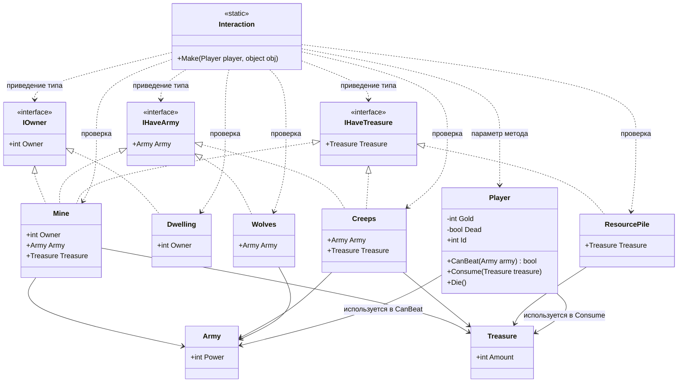

# Практика: HoMM

## 1. Описание предметной области и сущностей

Player - класс игрок, обладает золотом (Gold), может умереть (Dead), имеет идентификатор (Id) - это свойства. Он может сразиться с армией (CanBeat), собрать сокровища (Consume) и умереть (Die) - это методы класса.

Army - вспомогательный класс армия, есть параметр силы (Power).

Treasure - вспомогательный класс сокровища с количеством золота (Amount).

Dwelling - класс жилище, которое игрок может захватить (становится его владельцем Owner).

Mine - класс шахта, она охраняется армией, после победы игрок забирает сокровища (Treasure) и становится владельцем (Owner).

Creeps - класс нейтральные крипы, они охраняют сокровища, после победы игрок забирает сокровища.

Wolves - класс волки, имеет армию, игрок либо побеждает (ничего не получает, так как у них нет сокровищ), либо умирает.

ResourcePile - класс ресурсы без охраны, игрок просто забирает сокровища.

IOwner - интерфейс для объекта, у которого можно установить владельца (Owner).

IHaveArmy - интерфейс для объекта, имеющего армию для сражения (Army).

IHaveTreasure - интерфейс объекта, имеющего сокровища (Treasure).

Interaction - статический класс - точка входа для взаимодействия игрока с объектом на карте. Содержит единственный метод Make, который проверяет наличие армии и если игрок не может победить, он умирает, также он проверяет возможность присвоения владельца и ещё он проверяет наличие сокровищ, которые игрок забирает.

## 2. Диаграмма классов (Mermaid)

