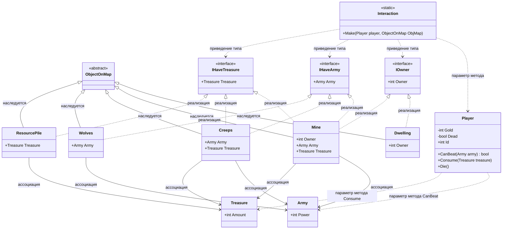

# Практика: HoMM

## 1. Описание предметной области и сущностей

Player - класс игрока, обладает золотом (Gold), может умереть (Dead), имеет идентификатор (Id). Методы: CanBeat(Army) - проверяет, может ли победить армию, Consume(Treasure) - забирает сокровища, Die - помечает игрока мёртвым.

Army - вспомогательный класс, содержит силу (Power).

Treasure - вспомогательный класс, содержит количество золота (Amount).

ObjectOnMap - абстрактный базовый класс для всех объектов на карте. Является общим предком и приводит в целое передачу объектов в метод взаимодействия. Также, если подумать про целостность данных, в отличие от object, теперь в метод Make нельзя передать объект, не являющийся частью карты.

Dwelling - жилище, которое игрок может захватить (становится владельцем Owner). Наследует ObjectOnMap и реализует IOwner.

Mine - шахта, охраняется армией (Army), содержит сокровища (Treasure). После победы игрок забирает сокровища и становится владельцем. Наследует ObjectOnMap, реализует IHaveArmy, IHaveTreasure, IOwner.

Creeps - нейтральные крипы, охраняют сокровища. После победы игрок забирает сокровища. Наследует ObjectOnMap, реализует IHaveArmy, IHaveTreasure.

Wolves - волки, имеют армию, но не имеют сокровищ. Игрок либо побеждает (ничего не получает), либо умирает. Наследует ObjectOnMap, реализует IHaveArmy.

ResourcePile - ресурсы без охраны, игрок просто забирает сокровища. Наследует ObjectOnMap, реализует только IHaveTreasure.

Интерфейсы:

IOwner - объект, у которого можно установить владельца (Owner).

IHaveArmy - объект, имеющий армию (Army).

IHaveTreasure - объект, имеющий сокровища (Treasure).

Interaction - статический класс, точка входа для взаимодействия игрока с объектом на карте. Метод Make(Player, ObjectOnMap): проверяет наличие армии, если игрок не может победить - игрок умирает, выполнение прерывается.

Если объект имеет сокровища - игрок забирает их.
Если объект может иметь владельца - устанавливает владельцем игрока.
## 2. Диаграмма классов (Mermaid)

```mermaid
classDiagram
    direction TB

    class ObjectOnMap {
        <<abstract>>
    }

    class Player {
        -int Gold
        -bool Dead
        +int Id
        +CanBeat(Army army) bool
        +Consume(Treasure treasure)
        +Die()
    }

    class Army{
        +int Power
    }

    class Treasure {
        +int Amount
    }

    class IOwner {
        <<interface>>
        +int Owner
    }

    class IHaveArmy {
        <<interface>>
        +Army Army
    }

    class IHaveTreasure {
        <<interface>>
        +Treasure Treasure
    }

    class Dwelling {
        +int Owner
    }

    class Mine {
        +int Owner
        +Army Army
        +Treasure Treasure
    }

    class Creeps {
        +Army Army
        +Treasure Treasure
    }

    class Wolves {
        +Army Army
    }

    class ResourcePile {
        +Treasure Treasure
    }


    class Interaction {
        <<static>>
        +Make(Player player, ObjectOnMap ObjMap)
    }

    %% Наследование от абстрактного класса
    ObjectOnMap <|-- Dwelling : наследуется
    ObjectOnMap <|-- Mine : наследуется
    ObjectOnMap <|-- Creeps : наследуется
    ObjectOnMap <|-- Wolves : наследуется
    ObjectOnMap <|-- ResourcePile : наследуется

    %% Реализации интерфейсов - Интерфейс <|.. Класс
    IOwner <|.. Dwelling : реализация
    IOwner <|.. Mine : реализация
    IHaveArmy <|.. Mine : реализация
    IHaveTreasure <|.. Mine : реализация
    IHaveArmy <|.. Creeps : реализация
    IHaveTreasure <|.. Creeps : реализация
    IHaveArmy <|.. Wolves : реализация
    IHaveTreasure <|.. ResourcePile : реализация

    %% Ассоциации - КлассА --> КлассБ
    Mine --> Army : ассоциация
    Mine --> Treasure : ассоциация
    Creeps --> Army : ассоциация
    Creeps --> Treasure : ассоциация
    Wolves --> Army : ассоциация
    ResourcePile --> Treasure : ассоциация

    %% Зависимости - КлассА ..> КлассБ
    Interaction ..> Player : параметр метода
    Interaction ..> IOwner : приведение типа
    Interaction ..> IHaveArmy : приведение типа
    Interaction ..> IHaveTreasure : приведение типа
    Player ..> Army : параметр метода CanBeat
    Player ..> Treasure : параметр метода Consume

```