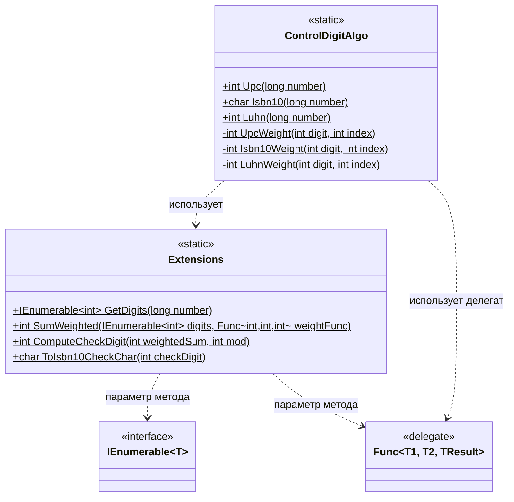

# Практика: Контрольный разряд
## 1. Описание предметной области и сущностей
В рамках решения задачи вычисления контрольных разрядов выделены две основные сущности:

Extensions - статический класс, предоставляющий набор общих методов-расширений для работы с числовыми последовательностями. Он отвечает за извлечение цифр из числа (GetDigits), вычисление взвешенной суммы (SumWeighted), расчёт контрольной цифры по модулю (ComputeCheckDigit) и преобразование значения контрольного разряда ISBN-10 в символ (ToIsbn10CheckChar). Эти методы не зависят от конкретного алгоритма и могут быть переиспользованы в других контекстах.

ControlDigitAlgo - статический класс, содержащий реализацию трёх алгоритмов вычисления контрольных разрядов: UPC, ISBN-10 и Luhn. Для каждого алгоритма определены приватные весовые функции (UpcWeight, Isbn10Weight, LuhnWeight), которые передаются в общий метод SumWeighted. Публичные методы класса (Upc, Isbn10, Luhn) принимают исходное число и возвращают вычисленную контрольную цифру (для ISBN-10 - символ, включая возможный X).

ControlDigitAlgo использует методы расширения из Extensions для получения цифр числа, вычисления взвешенной суммы и финального расчёта контрольной цифры. Также в сигнатурах методов задействованы системные типы IEnumerable<T> (для работы с последовательностями) и Func<...> (для передачи весовых функций). Никаких других зависимостей или отношений между классами нет.

## 2. Диаграмма классов (Mermaid)

