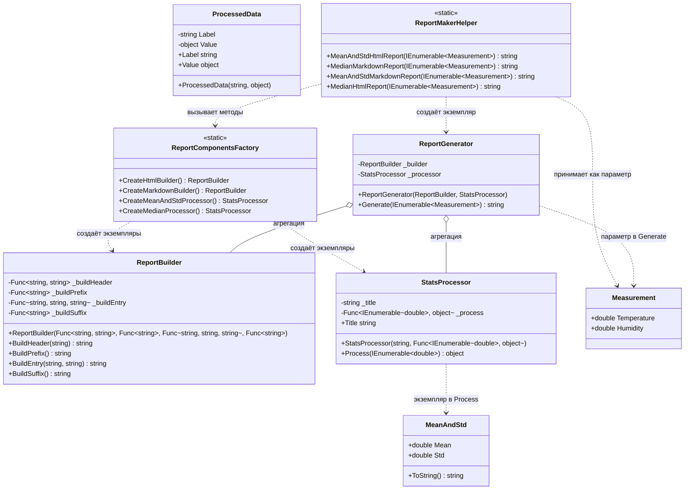

# Практика: Генератор отчётов

## 1. Описание предметной области и сущностей
Система генерирует статистические отчёты по данным погодных измерений, вычисляя различные показатели (среднее, стандартное отклонение, медиана) и выводя их в разных форматах (HTML, Markdown).

Measurement - исходные данные: температура и влажность

MeanAndStd - результат статистики: среднее и стандартное отклонение, форматируется ввиде "среднее +- отклонение"

ReportBuilder - отвечает за визуальное оформление отчёта, использует делегаты для гибкого форматирования, поддерживает HTML, Markdown и другие форматы

StatsProcessor - вычисляет статистические показатели, поддерживает различные алгоритмы (среднее+отклонение, медиана), содержит название статистики для отчёта

ReportGenerator - координирует процесс создания отчёта, комбинирует построитель и обработчик, формирует итоговый отчёт из набора измерений

ReportComponentsFactory - создаёт готовые компоненты для отчётов, централизует создание построителей и обработчиков

ReportMakerHelper - предоставляет простой API для создания отчётов, содержит четыре стандартных метода создания отчётов

Реализация состоит из двух частей: ReportBuilder - визуальная составляющая и StatsProcessor для статистических расчётов. Они объединяются в ReportGenerator.

## 2. Диаграмма классов (Mermaid)

