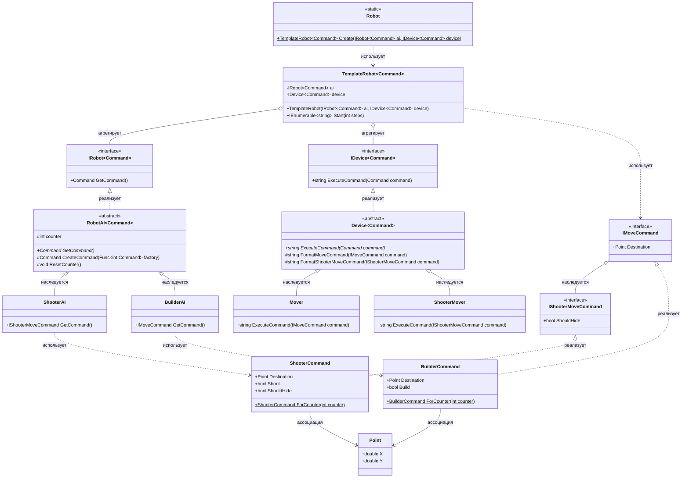

# Практика: Роботы

## 1. Описание предметной области и сущностей
В системе моделируется робот, который генерирует и выполняет команды перемещения (и при необходимости, стрельбы с укрытием).  
Части робота:
1. AI - генерирует команды (к примеру ShooterAI формирует команды стрельбы, BuilderAI - строительство).
2. Device - исполняет команды (Mover просто перемещает, ShooterMover перемещает с укрытием и т.д.).

Сущности:
- Robot - статический класс, фабрика, создающая экземпляры TemplateRobot<Command>.
- TemplateRobot<Command> - обобщённый класс, собственно робот, связывающий AI и Device.
- IRobot<out Command> - интерфейс, предоставляет метод получения команды. Является ковариантным.
- IDevice<in Command> - интерфейс, предоставляет метод выполнения команды. Является контрвариантным.
- RobotAI<Command> - абстрактный базовый класс для всех AI.
- ShooterAI - конкретный класс, генерирует команды IShooterMoveCommand.
- BuilderAI - конкретный класс, генерирует команды IMoveCommand.
- Device<Command> - абстрактный базовый класс, реализация девайсов с методами форматирования.
- Mover - конкретный класс, выполняет команды IMoveCommand (простое перемещение).
- ShooterMover - конкретный класс, выполняет команды IShooterMoveCommand.
- ShooterCommand - класс, реализация IShooterMoveCommand с фабрикой.
- BuilderCommand - класс, реализация IMoveCommand с фабрикой.
- Point - класс, хранит координаты X и Y.
- IMoveCommand - интерфейс, команда перемещения (содержит точку Point).
- IShooterMoveCommand - интерфейс, который расширяет IMoveCommand, добавляя так называемый ShouldHide.

Обобщённые интерфейсы с out или in позволяют использовать AI, возвращающие более конкретные команды, с Device, принимающими более общие команды и наоборот.

Базовый класс я вывел чтобы избежать дублирования кода, улучшить общую логику создания команд и их форматирования для всех наследников.
## 2. Диаграмма классов (Mermaid)

