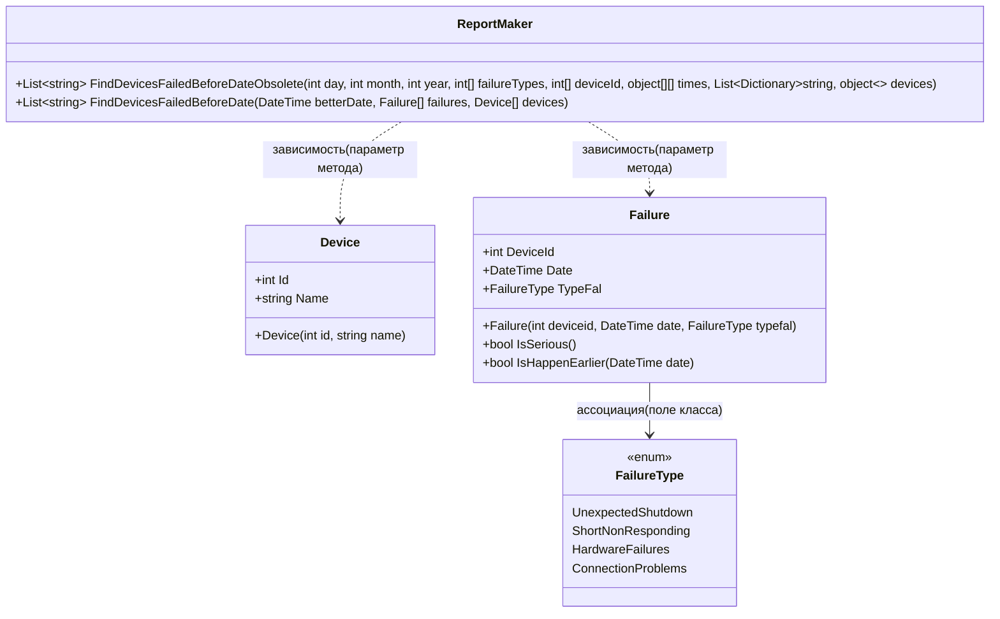

# Практика: Сбои

## 1. Описание предметной области и сущностей
1. ReportMaker - класс, который фильтрует серьёзные сбои (UnexpectedShutdown, HardwareFailures) до указанной даты, в нём реализованы методы: устаревший(FindDevicesFailedBeforeDateObsolete) и новый (FindDevicesFailedBeforeDate)
2. Device - это устройство (Id, Name)
3. Failure - это сбои (DeviceId, Date, Type)
4. FailureType - перечисленные типы сбоя (UnexpectedShutdown, ShortNonResponding, HardwareFailures, ConnectionProblems)
## 2. Диаграмма классов (Mermaid)

