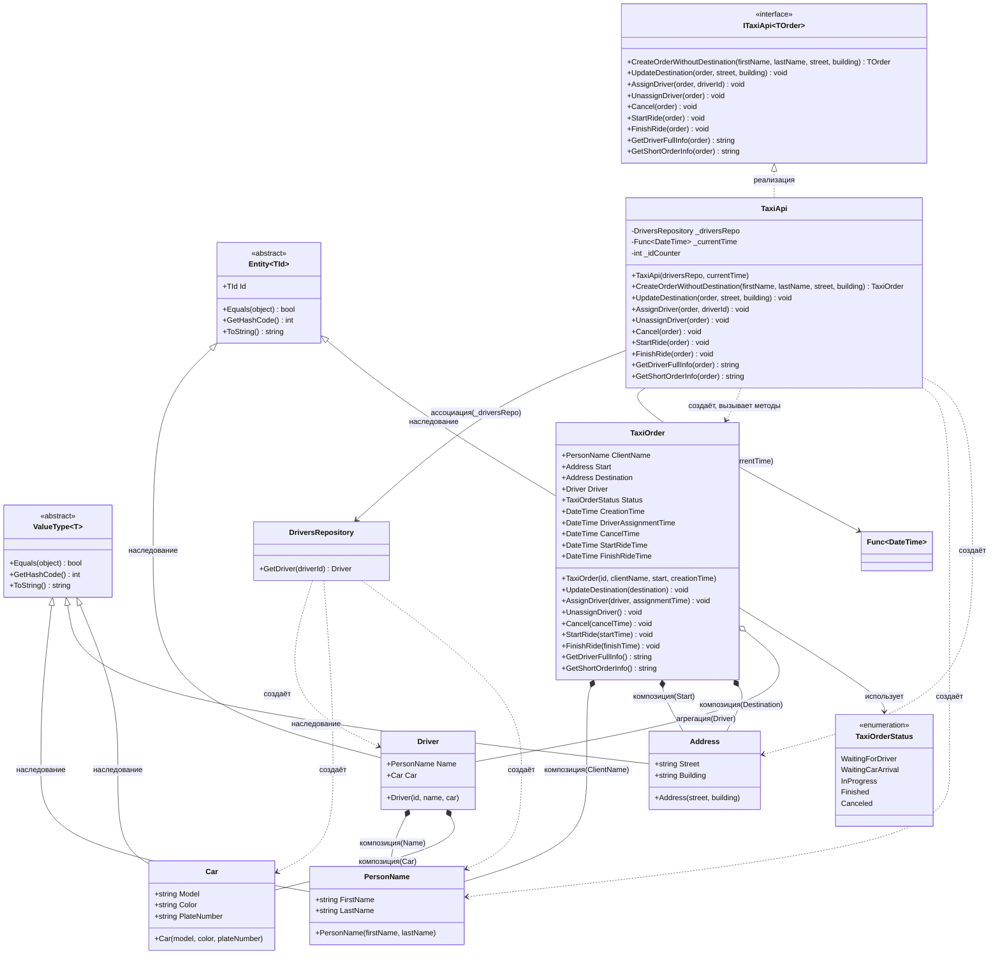

# Практика: TaxiOrder

## 1. Описание предметной области и сущностей
В рамках задания выполнена переработка анемичной модели заказа такси в богатую(Rich) доменную модель, основанную на принципах DDD.

Сущности:
- TaxiOrder - сущность, управляющая циклом заказа. Хранит информацию о клиенте, маршруте (начальный адрес и пункт назначения), назначенном водителе, текущем статусе и временных метках ключевых событий. Предоставляет методы для безопасного изменения состояния с проверкой допустимости операций в каждом статусе (UpdateDestination, AssignDriver, UnassignDriver, Cancel, StartRide, FinishRide).
- Driver - сущность, представляющая водителя. Содержит идентификатор, имя (PersonName) и автомобиль (Car).
- PersonName, Address, Car - объекты-значения, неизменяемые и сравниваемые по всем свойствам.
- DriversRepository - репозиторий, отвечающий за получение сущности Driver по идентификатору.  
- TaxiApi - тонкий слой, реализующий интерфейс ITaxiApi<TaxiOrder>. Делегирует все бизнес операции методам самого заказа, сохраняя обратную совместимость с существующими тестами.

Взаимодействие строится через TaxiApi. клиент создаёт заказ, обновляет пункт назначения, назначает или отменяет водителя, запускает и завершает поездку. Все проверки на допустимость действий инкапсулированы внутри TaxiOrder. Это делает модель самодостаточной и устойчивой к некорректным вызовам.

## 2. Диаграмма классов (Mermaid)

