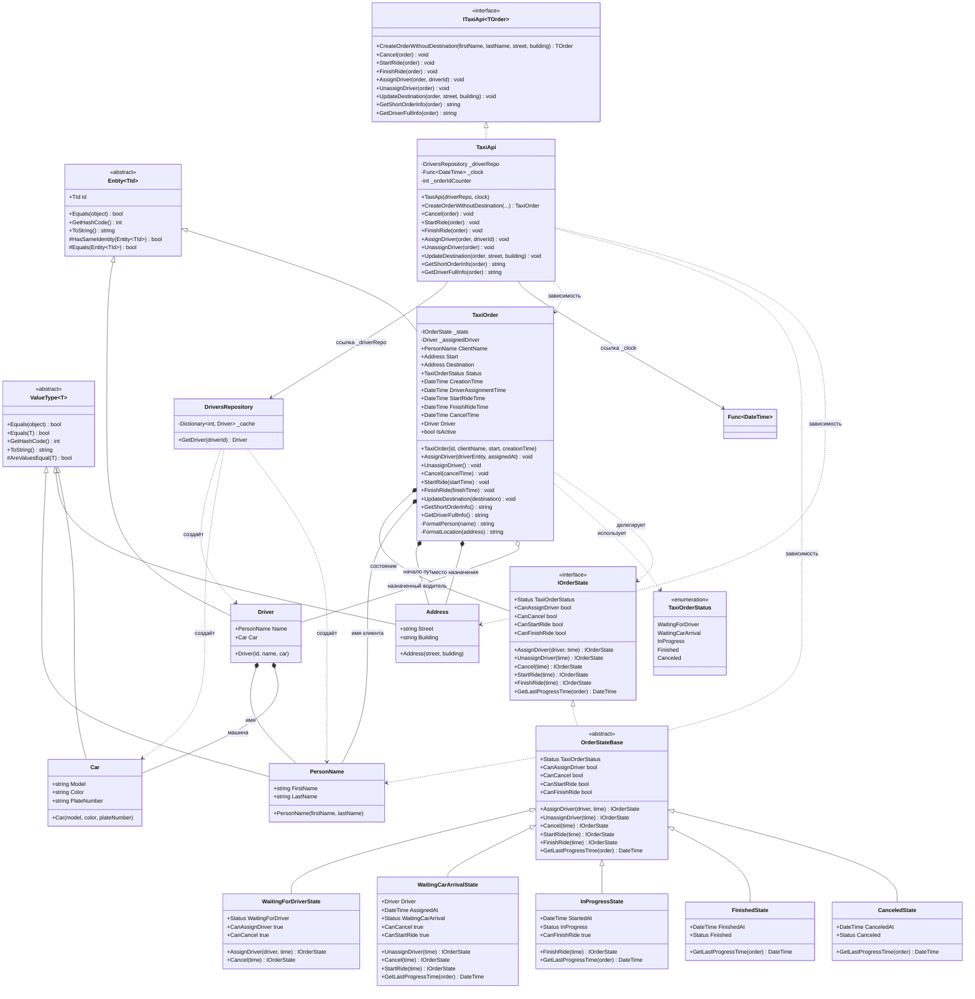

# Практика: TaxiOrder

## 1. Описание предметной области и сущностей
В рамках задания выполнена переработка анемичной модели заказа такси в богатую (Rich) доменную модель, основанную на принципах DDD.

Базовые инфраструктурные классы:

Entity<TId> - базовый абстрактный класс для всех DDD-сущностей. Обеспечивает уникальную идентификацию через свойство Id и сравнение сущностей по идентификатору. Добавлен защищённый метод HasSameIdentity для централизованной проверки идентичности.

ValueType<T> - базовый абстрактный класс для всех объектов-значений. Обеспечивает сравнение объектов по содержимому (переопределение Equals/GetHashCode) и автоматическое формирование строкового представления на основе публичных свойств. Содержит защищённый метод AreValuesEqual для унифицированного сравнения.

Объекты-значения:

PersonName - представляет имя человека. Содержит свойства FirstName и LastName. Неизменяем.

Address - представляет адрес. Содержит свойства Street и Building. Неизменяем.

Car - описывает автомобиль. Содержит свойства Model, Color, PlateNumber. Неизменяем.

Сущности:

Driver - сущность, представляющая водителя. Имеет идентификатор (Id), имя (PersonName) и автомобиль (Car).

TaxiOrder - агрегатная сущность, управляющая жизненным циклом заказа такси. Хранит информацию о клиенте (ClientName), начальном адресе (Start), пункте назначения (Destination), назначенном водителе (Driver), текущем статусе (Status) и временных метках ключевых событий (CreationTime, DriverAssignmentTime, StartRideTime, FinishRideTime, CancelTime).
Предоставляет методы для проверки допустимости переходов (IsDriverAssignable(), IsCancelable(), IsRideStartable(), IsRideFinishable()) и команды для изменения состояния (Cancel, StartRide, FinishRide, AssignDriver, UnassignDriver, UpdateDestination).
Добавлено вспомогательное свойство IsActive, сигнализирующее о том, что заказ не завершён и не отменён.
Внутренняя логика статусов и временных меток вынесена в иерархию состояний (паттерн «Состояние»).

Паттерн «Состояние»:

IOrderState - интерфейс, определяющий контракт для всех состояний заказа. Содержит свойства для проверки допустимости действий и методы для переходов между состояниями.

OrderStateBase - абстрактный базовый класс, предоставляющий стандартную реализацию для всех состояний.

Конкретные состояния: WaitingForDriverState, WaitingCarArrivalState, InProgressState, FinishedState, CanceledState. Каждое состояние определяет, какие действия разрешены, и управляет переходом к следующему состоянию.

Репозиторий:

DriversRepository - репозиторий, отвечающий за получение сущности Driver по идентификатору. Не зависит от заказов, работает только с данными о водителях. Для повышения производительности использует внутренний кэш (_cache).

API слой:

ITaxiApi<TOrder> - интерфейс, определяющий контракт для управления заказами такси. Содержит методы создания заказа, обновления пункта назначения, назначения и отмены водителя, отмены заказа, начала и завершения поездки, а также получения краткой информации и полной информации о водителе.
Порядок методов в интерфейсе изменён для улучшения читаемости и семантической группировки.

TaxiApi - реализация интерфейса ITaxiApi<TaxiOrder>. Является тонким слоем, который преобразует входные данные в объекты-значения (PersonName, Address) и делегирует все бизнес-операции методам TaxiOrder. Сохраняет обратную совместимость с существующими тестами. Использует DriversRepository и внешний источник времени (Func<DateTime>).

Перечисление:

TaxiOrderStatus - определяет возможные состояния заказа:
WaitingForDriver - ожидание водителя,
WaitingCarArrival - водитель назначен, ожидание прибытия,
InProgress - поездка начата,
Finished - поездка завершена,
Canceled - заказ отменён.

Взаимодействие:
Взаимодействие строится через TaxiApi. Клиент создаёт заказ, обновляет пункт назначения, назначает или отменяет водителя, запускает и завершает поездку. Все проверки на допустимость действий инкапсулированы внутри TaxiOrder (с использованием паттерна «Состояние»). Это делает модель самодостаточной, устойчивой к некорректным вызовам и легко тестируемой.
## 2. Диаграмма классов (Mermaid)

